# 基于springboot的英语知识应用网站

---
### 👉作者QQ ：1556708905 微信：zheng0123Long (支持定制修改、部署调试、定制毕设)

### 👉接网站建设、小程序、H5、APP、各种系统等

---

#### 介绍

在全球化日益加深的背景下，英语学习的需求持续增长。为了满足不同用户对于英语学习的多样化需求，我们开发了基于 Spring Boot 的英语知识应用网站。该网站旨在提供一个全面、高效、便捷的英语学习平台，帮助用户提升英语水平，增强语言运用能力。

#### 技术栈

后端技术栈：Springboot+Mysql+Maven

前端技术栈：Vue+Html+Css+Javascript+ElementUI

开发工具：Idea+Vscode+Navicate

#### 系统功能介绍

（一）管理员角色  
个人中心：管理员可以在个人中心查看和修改自己的个人信息，包括账号设置、密码修改等，同时接收系统重要通知和任务提醒。  
用户管理：对网站的用户进行综合管理，包括审核新用户注册、查看用户详细资料、对违规用户进行处理等，保障平台用户的合法性和安全性。  
在线学习管理：负责上传、更新和删除在线学习课程资源，确保学习内容的质量和时效性。  
学习技巧管理：整理和分享有效的英语学习技巧和方法，帮助用户提高学习效率。  
培训信息管理：发布和管理各类英语培训课程的信息，包括课程介绍、师资力量、上课时间等。  
培训报名管理：处理用户的培训报名申请，审核报名资格，安排课程班次等。  
试题管理：创建、编辑和更新英语试题库，为考试和练习提供丰富的题目资源。  
交流论坛：监督论坛的交流内容，确保交流环境的健康和积极，处理违规发言和不良信息。  
我的收藏管理：查看和分析管理员自身的收藏内容，以便更好地管理和优化网站资源。  
试卷管理：设计和组织英语试卷，包括设置题型、分值、考试时间等。  
系统管理：进行系统的参数配置、数据备份与恢复、权限分配等操作，保障系统的稳定运行和安全性。  
考试管理：安排考试时间、监考人员，统计考试成绩，为评估学习效果提供依据。  

（二）用户角色  
在线学习：用户可以随时随地访问丰富的在线学习课程，按照自己的需求和进度进行学习。  
学习技巧：获取实用的英语学习技巧和策略，应用于日常学习中，提升学习效果。  
培训信息：查看详细的培训课程信息，根据自身情况选择适合的培训课程并报名参加。  
英语角：在英语角与其他用户进行交流和互动，锻炼口语表达和交流能力。  
试卷列表：浏览并选择各种类型的试卷进行练习和自我检测，了解自己的学习水平。  
个人中心：在个人中心，用户可以修改个人资料、查看学习记录、管理收藏的学习资源等。  
后台管理  
在线学习管理：对自己参与的在线学习课程进行进度跟踪和学习计划调整。  
学习技巧管理：收藏和整理对自己有帮助的学习技巧，方便随时查阅。  
培训信息管理：查看已报名培训课程的详细信息和安排。  
培训报名管理：提交培训报名申请，查看报名审核结果。  
我的收藏管理：管理自己收藏的学习资料、课程、试题等。  
交流论坛：参与论坛讨论，分享学习经验，提出问题，获得帮助。  
系统管理：了解系统的相关设置和规则。  
考试管理：查看考试安排和成绩，分析自己的学习成果。  
在线客服：在学习过程中遇到问题时，可通过在线客服及时获得帮助和解答。  

#### 系统作用

个性化学习体验  
满足不同用户的学习需求和水平，提供定制化的学习路径和资源。  
提升学习效果  
丰富的学习内容、技巧和练习机会，有助于用户更系统、有效地学习英语。  
教学资源优化  
帮助管理员合理组织和更新学习资源，确保资源的高质量和适用性。  
增强互动交流  
英语角和交流论坛促进用户之间的互动，营造良好的学习氛围。  
学习管理便捷  
无论是管理员对教学活动的管理，还是用户对自身学习的管理，都更加方便和高效。  
#### 系统功能截图

代码结构

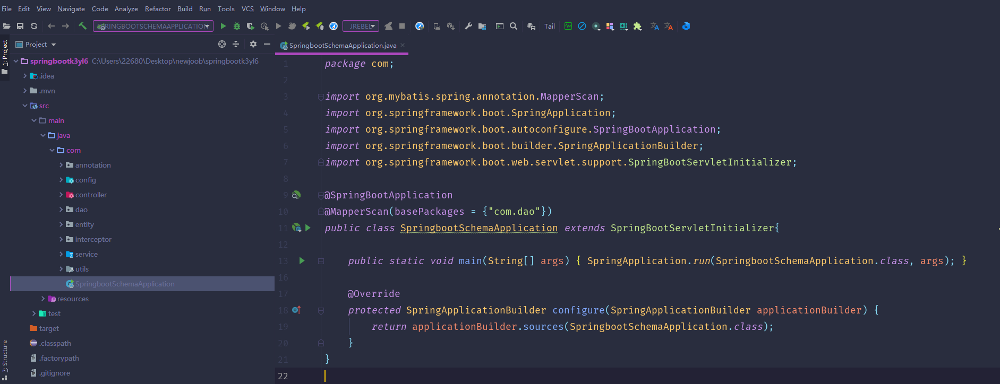

数据库表

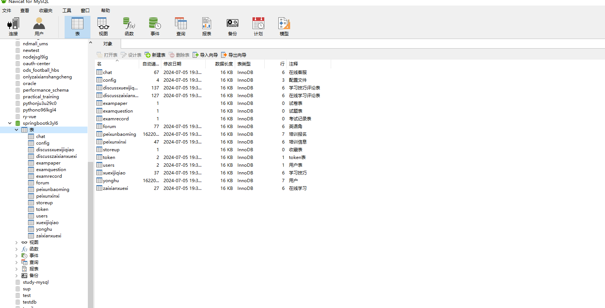

登录

用户管理

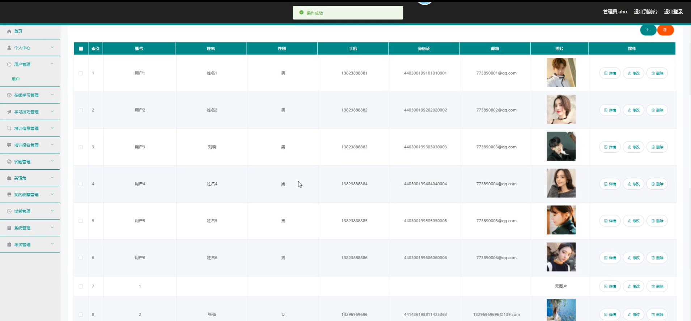

在线学习管理

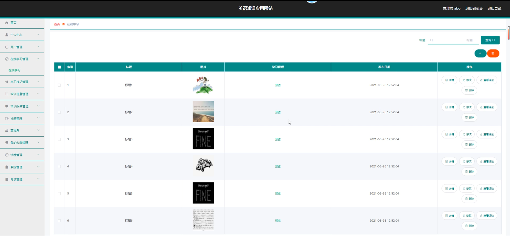

学习技巧管理

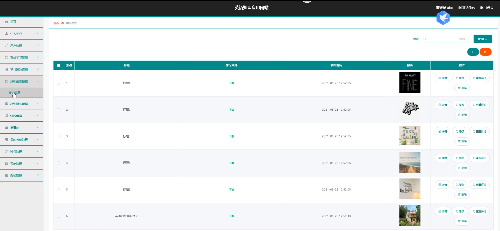

培训信息管理

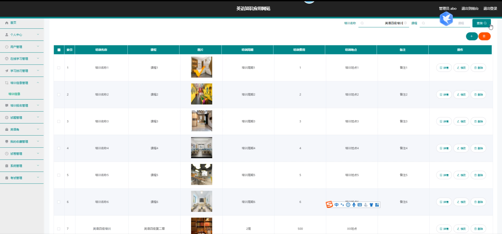

试题管理

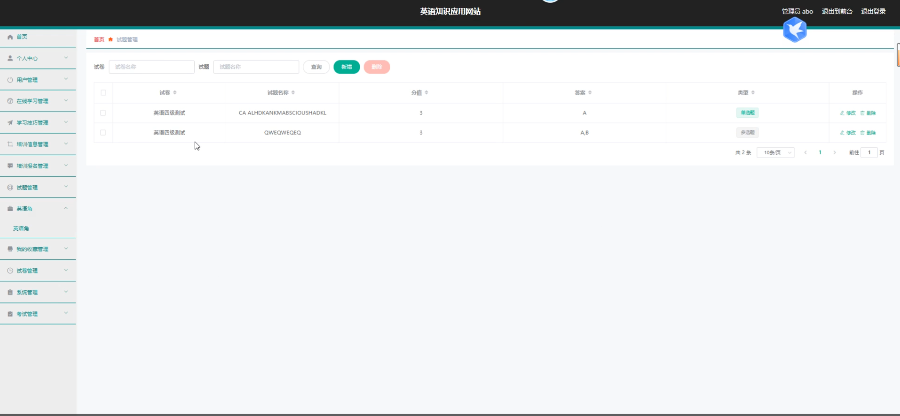

前台页面个人中心

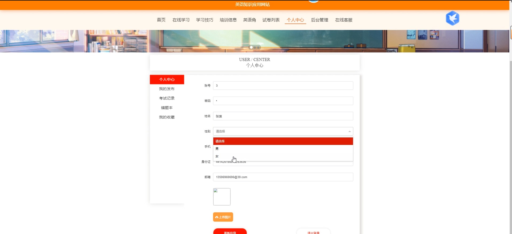

在线学信

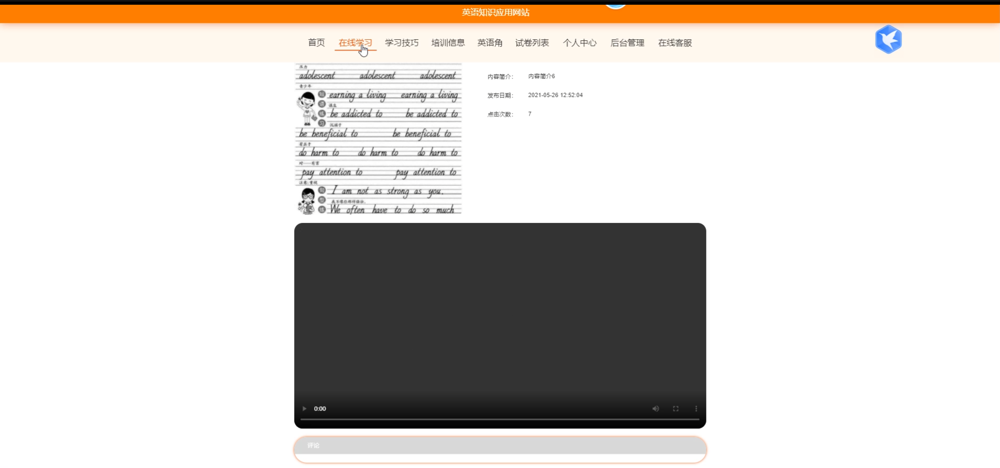

训练信息

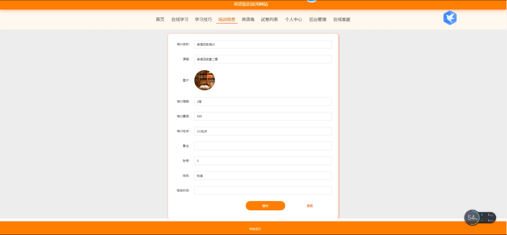

交流论坛

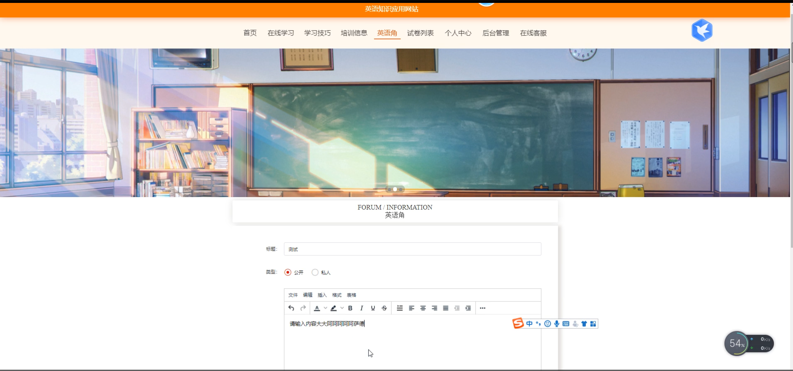

在线客服

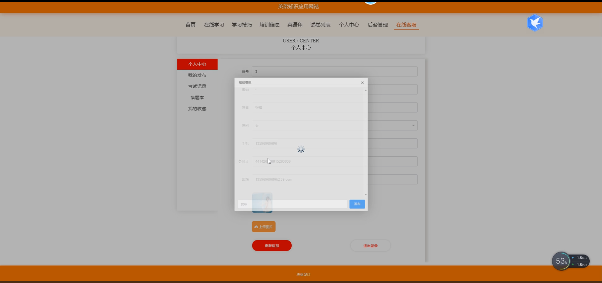

用户端后台管理

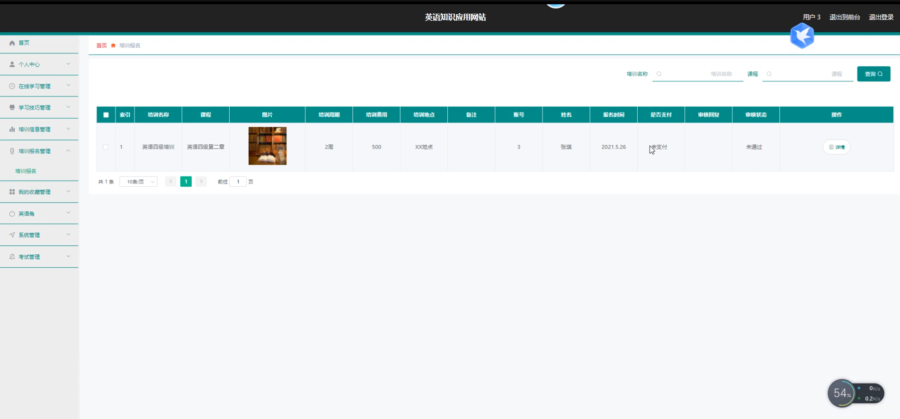

#### 总结

基于 Spring Boot 的英语知识应用网站通过清晰的角色划分和全面的功能模块，为管理员和用户搭建了一个优质、便捷、互动性强的英语学习平台。它不仅为用户提供了丰富的学习资源和高效

#### 使用说明

创建数据库，执行数据库脚本 修改jdbc数据库连接参数 下载安装maven依赖jar 启动idea中的springboot项目

后台地址：http://localhost:8080/springbootk3yl6/admin/dist/index.html

管理员  abo 密码 abo

前台地址：http://localhost:8080/springbootk3yl6/front/index.html
